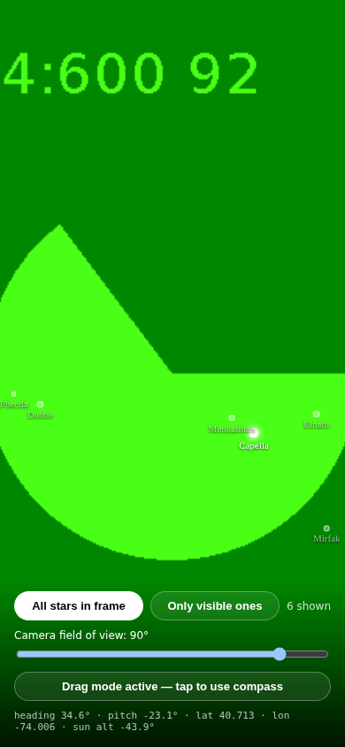
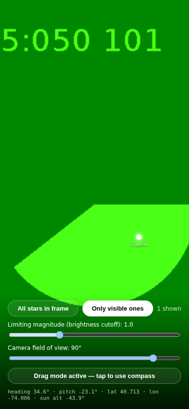

# Stargazer

A prototype AR sky-identification app: point your phone's camera at the sky
and it labels every star that *should* be in frame — whether or not it's
actually bright enough to see right now.

## Demo

These are real screenshots of the running app (captured headlessly, so the
"camera feed" is Chromium's synthetic test pattern instead of an actual sky —
on a real phone that background is your live camera view). Location was
mocked to New York City at night; same field of view and heading in both.

| All stars in frame | Only visible ones |
| --- | --- |
|  |  |
| Every catalog star geometrically in view. Dimmer stars are drawn faded because they don't clear the brightness cutoff. | Same view, same cutoff (magnitude 1.0) — filtered to just the star that would actually be visible. |

## How it works

1. **Camera** (`getUserMedia`) fills the background, like a normal camera app.
2. **GPS** (`Geolocation`) gives your location.
3. **Compass + tilt** (`DeviceOrientationEvent`) give the heading and
   elevation the back camera is pointed at.
4. For every star in the built-in catalog, its RA/Dec is converted to
   Alt/Az for your location and the current time
   (`src/lib/astro.ts`), then projected into screen-space pixels for
   whatever direction the phone is currently pointed
   (`src/lib/projection.ts`), using the same perspective-projection math a
   real camera lens uses.
5. Anything within the camera's field of view is drawn as a labeled dot
   over the live camera feed.

### "All stars" vs. "Only visible"

- **All stars in frame** shows every catalog star geometrically within
  view, even ones you couldn't actually see (below your brightness
  threshold, or the sky's too bright). Those are drawn dimmed, so you can
  see what's "there" behind the glare.
- **Only visible ones** filters down to stars that would realistically show
  up: above a brightness (magnitude) cutoff you control with a slider, and
  only when the sun is below -6° altitude (otherwise the sky's too bright
  for anything to be visible, day or twilight).

There's also a field-of-view slider, since phone cameras vary.

## Running it

```bash
npm install
npm run dev -- --host
```

Then open the printed URL. **Camera and orientation sensors require a
secure context** (HTTPS or `localhost`) — on a real phone you'll need to
either serve over HTTPS (e.g. `npx vite --host` behind a tunnel like
ngrok/Cloudflare Tunnel, or deploy to any static host) or use
`https://<your-lan-ip>` with a locally trusted cert.

On iOS Safari, tap **Start** to trigger the compass permission prompt —
iOS requires a user gesture before `DeviceOrientationEvent.requestPermission()`
will work.

If sensors aren't available (e.g. testing on a laptop), the app falls back
to **drag-to-look**: click/touch and drag on the screen to pan the virtual
camera manually.

## Known limitations (prototype scope)

- Star catalog is a curated set of ~90 of the brightest naked-eye stars,
  not a full astrometric database — good for a demo, not for spotting
  faint deep-sky objects.
- "Visible" is a simple heuristic (magnitude cutoff + sun altitude) — it
  doesn't account for light pollution, moonlight, or cloud cover.
- The projection assumes the phone is held with no roll (i.e., not tilted
  sideways) — panning up/down/left/right works, but rotating the phone
  about the camera axis isn't corrected for yet.
- Compass heading accuracy depends entirely on the device's magnetometer;
  expect it to need calibration (the classic figure-8 wave) on some phones.
