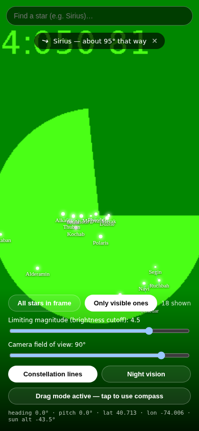
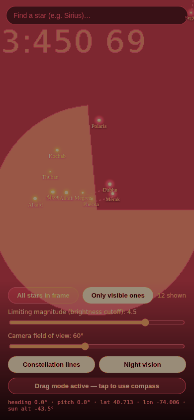

# Stargazer

A prototype AR sky-identification app: point your phone's camera at the sky
and it labels every star that *should* be in frame — whether or not it's
actually bright enough to see right now.

## Demo

These are real screenshots of the running app (captured headlessly, so the
"camera feed" is Chromium's synthetic test pattern instead of an actual sky —
on a real phone that background is your live camera view). Location was
mocked to New York City at night; same field of view and heading in both.

| All stars in frame | Only visible ones |
| --- | --- |
|  |  |
| Every catalog star geometrically in view. Dimmer stars are drawn faded because they don't clear the brightness cutoff. | Same view, same cutoff (magnitude 1.0) — filtered to just the star that would actually be visible. |

| Find a star | Night vision |
| --- | --- |
|  |  |
| Search for any catalog star; if it's out of frame, a banner points the way and estimates the distance to pan. Constellation line art (dashed) connects recognizable figures like the Big Dipper. | Toggling "Night vision" tints the whole screen red — the classic trick for reading a screen without ruining your eyes' dark adaptation. |

## How it works

1. **Camera** (`getUserMedia`) fills the background, like a normal camera app.
2. **GPS** (`Geolocation`) gives your location.
3. **Compass + tilt** (`DeviceOrientationEvent`) give the heading and
   elevation the back camera is pointed at.
4. For every star in the built-in catalog, its RA/Dec is converted to
   Alt/Az for your location and the current time
   (`src/lib/astro.ts`), then projected into screen-space pixels for
   whatever direction the phone is currently pointed
   (`src/lib/projection.ts`), using the same perspective-projection math a
   real camera lens uses.
5. Anything within the camera's field of view is drawn as a labeled dot
   over the live camera feed.

### "All stars" vs. "Only visible"

- **All stars in frame** shows every catalog star geometrically within
  view, even ones you couldn't actually see (below your brightness
  threshold, or the sky's too bright). Those are drawn dimmed, so you can
  see what's "there" behind the glare.
- **Only visible ones** filters down to stars that would realistically show
  up: above a brightness (magnitude) cutoff you control with a slider, and
  only when the sun is below -6° altitude (otherwise the sky's too bright
  for anything to be visible, day or twilight).

There's also a field-of-view slider, since phone cameras vary.

### Finding a specific star

Type a name into the search bar to look it up. If it's already in frame, a
glowing ring highlights it. If it's not, a banner appears with an arrow
rotated to point the way and a rough "how many degrees to pan" estimate
(`src/lib/guide.ts`), so you can use the app to *find* something, not just
label what's already visible.

### Constellation lines

A handful of well-known constellations/asterisms (Orion, the Big Dipper,
the Southern Cross, Cassiopeia, Leo) are drawn as dashed line art connecting
their stars (`src/lib/constellations.ts`), toggleable from the controls.
Only figures where the catalog has enough of the traditional stars to look
right are included — most constellations only have one or two catalog
entries, not enough for a recognizable shape.

### Night vision mode

Toggling "Night vision" tints the whole screen (camera feed included) deep
red, the standard trick astronomers use to read a screen or app without
ruining eyes that have adapted to the dark.

## Try it on your phone

Camera and orientation sensors only work over HTTPS (see below), so a
GitHub Actions workflow (`.github/workflows/deploy-pages.yml`) builds and
publishes this app to GitHub Pages — a real HTTPS URL you can open directly
on a phone, no tunnel or local server needed. It runs the test suite before
every deploy, so a broken build never goes live.

**One-time setup** (repo admin, not something this workflow can do itself):
in this repo's **Settings → Pages**, set **Source** to **GitHub Actions**.
After that, every push to `main` or this branch deploys automatically —
check the **Actions** tab for the run and its live URL, or **Settings →
Pages** once it's deployed. It'll be at
`https://<github-username>.github.io/Stargazer/`.

## Running it locally

```bash
npm install
npm run dev -- --host
```

Then open the printed URL. **Camera and orientation sensors require a
secure context** (HTTPS or `localhost`) — on a real phone you'll need to
either serve over HTTPS (e.g. `npx vite --host` behind a tunnel like
ngrok/Cloudflare Tunnel, or deploy to any static host) or use
`https://<your-lan-ip>` with a locally trusted cert.

On iOS Safari, tap **Start** to trigger the compass permission prompt —
iOS requires a user gesture before `DeviceOrientationEvent.requestPermission()`
will work.

If sensors aren't available (e.g. testing on a laptop), the app falls back
to **drag-to-look**: click/touch and drag on the screen to pan the virtual
camera manually.

## Testing

The astronomy and projection math (`src/lib/*.ts`) is covered by unit tests,
independent of any UI or sensors:

```bash
npm test
```

This checks things like: at the North/South pole a star's altitude always
equals (plus or minus) its declination; a target at the exact center of the
camera's view always projects to the screen's center; rolling the camera
90° turns a purely-vertical offset into a purely-horizontal one; every star
name referenced in the constellation line art actually exists in the
catalog (a real bug this caught once already, from a typo).

## Known limitations (prototype scope)

- Star catalog is a curated set of ~95 of the brightest naked-eye stars,
  not a full astrometric database — good for a demo, not for spotting
  faint deep-sky objects.
- "Visible" is a simple heuristic (magnitude cutoff + sun altitude) — it
  doesn't account for light pollution, moonlight, or cloud cover.
- Roll (tilt around the camera's own optical axis) is now compensated for
  using the device's raw tilt sensors (`rollDegFromTilt` in
  `src/hooks/useDeviceOrientation.ts`), but the sign convention hasn't been
  validated on a real phone yet — only its mathematical properties are
  covered by unit tests. Treat it as best-effort until confirmed in the
  field; drag-to-look is unaffected either way.
- Compass heading accuracy depends entirely on the device's magnetometer;
  expect it to need calibration (the classic figure-8 wave) on some phones.
- The "find a star" distance estimate is a small-angle approximation, not
  an exact great-circle distance — fine for "about N degrees that way," not
  for precision pointing.
